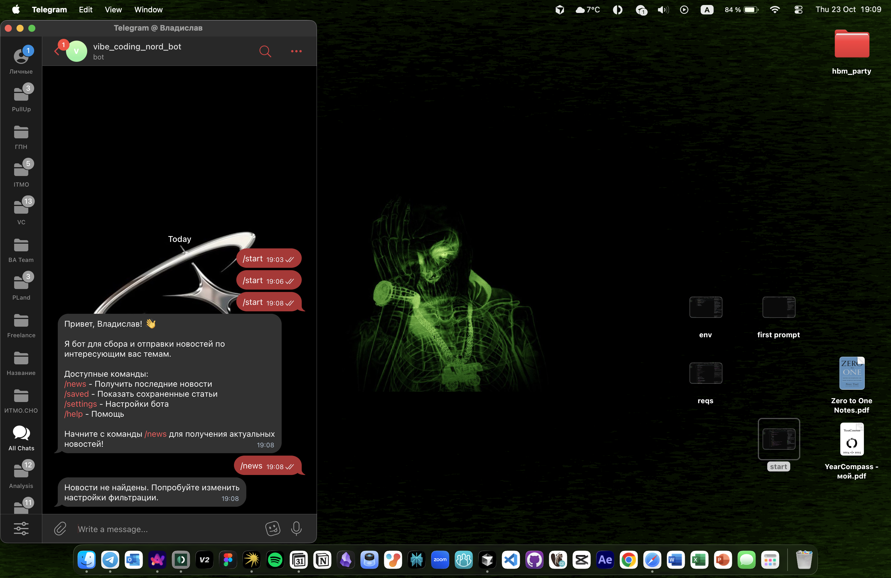

# Отчет по лабораторной работе №1

## Описание работы

Данная лабораторная работа посвящена изучению работы с AI-ассистентами и их возможностей.

### 1. Первый промпт

*Рисунок 2: Ввод первого промпта для взаимодействия с AI-ассистентом*

### 2. Требования

*Рисунок 3: Требования и условия выполнения лабораторной работы*

### 3. Настройка окружения

*Рисунок 4: Настройка рабочего окружения и параметров*

### 4. Старт

*Рисунок 1: Начальный экран приложения*

### 5. Результат работы - Бот

*Рисунок 5: Созданный бот как результат выполнения лабораторной работы*

5. Тег бота 
https://t.me/vibe_coding_nord_bot

6. Видео с работой бота 
https://disk.yandex.ru/i/jvJ8byMpWdJ2rQ

## Выводы

В ходе выполнения лабораторной работы были изучены основы работы с AI-ассистентами, настройка рабочего окружения и создание простого бота. Работа выполнена успешно, все поставленные задачи решены.

## Заключение

Лабораторная работа позволила получить практический опыт работы с современными AI-технологиями и понять принципы их функционирования.
