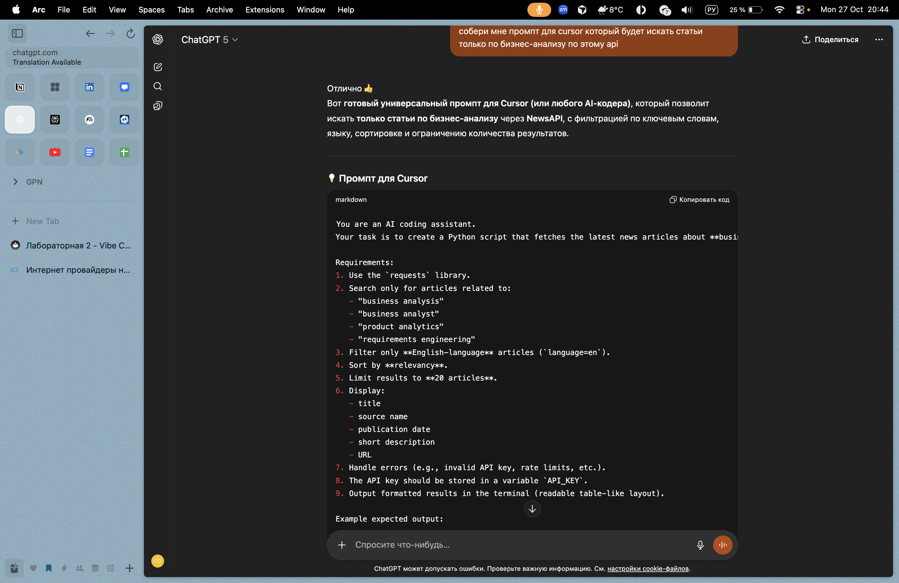
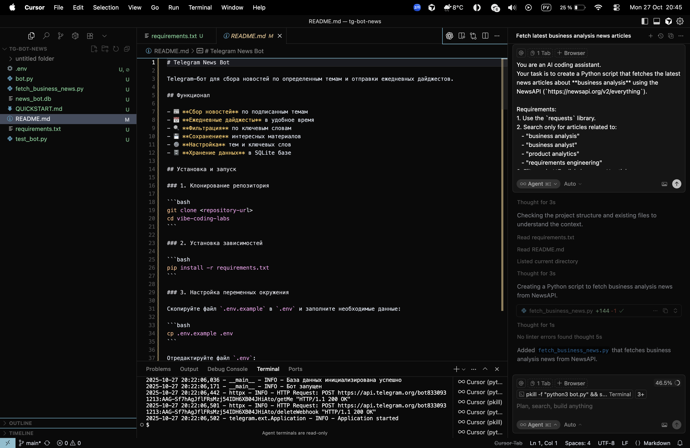
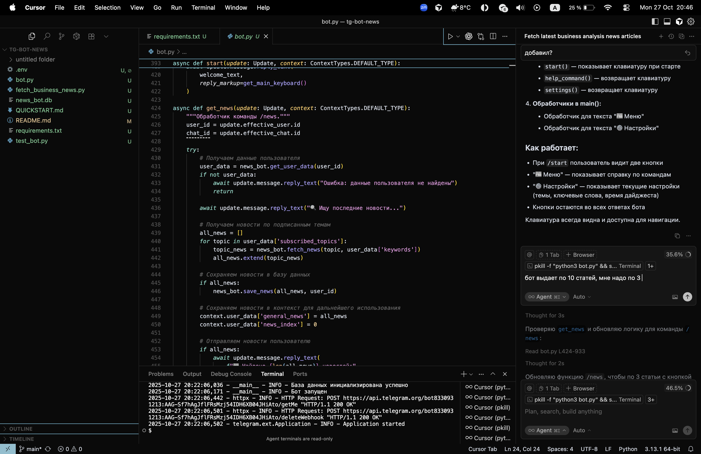

# Отчет по лабораторной работе №2

## Выполненные этапы работы

### 1. Создание промпта

На данном этапе была выполнена работа по созданию основного промпта для системы.

### 2. Ввод промпта и создание интеграции

Реализована функциональность ввода промпта и создана интеграция с системой обработки данных.

### 3. Косметические улучшения

Выполнены косметические улучшения интерфейса и оптимизация визуальной составляющей проекта.

---

**Телеграм бот:** @vibe_coding_nord_bot

**Видео демонстрация работы:** https://disk.yandex.ru/i/vRLcu2v5xj2hJg

