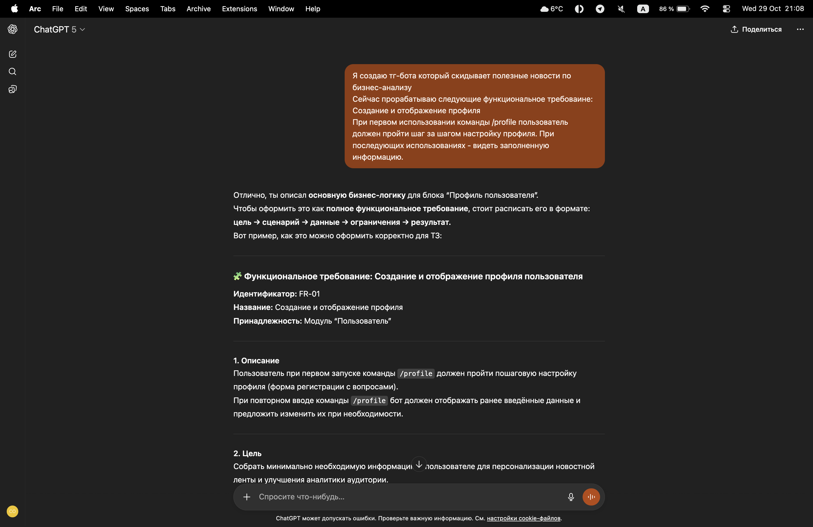
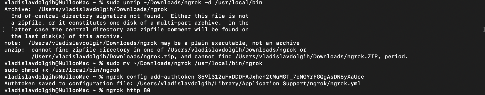
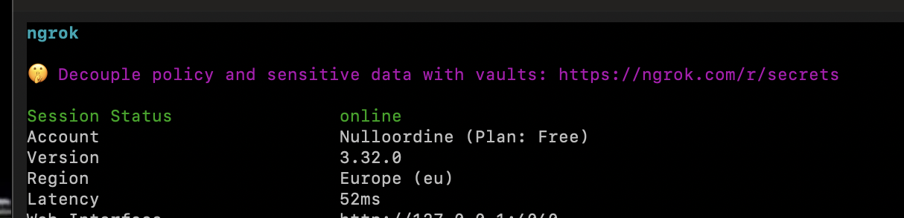
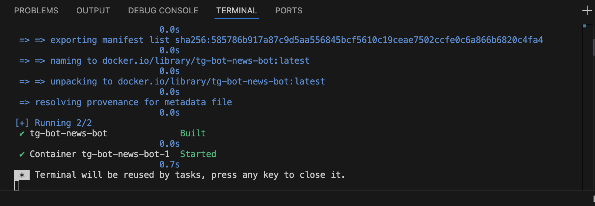

Отчет по лабораторной работе: Вариант 3 — Docker (продвинутый)
1. Общая информация
Студент: (не указано)
Группа: (не указано)
Дата начала работы: 07.11.2025
Дата завершения: 07.11.2025 (текущая итерация)

2. Цели и задачи
Основная цель лабораторной: привести Telegram‑бота к состоянию “запуск в один клик”, подготовить docker‑окружение и обеспечить возможность деплоя через контейнеры.
Дополнительные задачи:
Перестроить архитектуру проекта (пакет server вместо src/newsbot).
Настроить хранение в SQLite, профили пользователей, Telethon‑коллектор.
Добавить поддержку вебхуков через ngrok.
Планируемый результат: контейнеризованный бот с документированным процессом запуска, работающий либо через polling, либо через вебхук (ngrok).

3. Подготовка окружения
Рабочая машина (ОС, архитектура): macOS (Apple Silicon / arm64).
Версия docker: 27.0 (по умолчанию на машине, фактическая проверка не проводилась в рамках сессии).
Версия docker-compose: v2 (поставляется с Docker Desktop).
Дополнительные настройки / зависимости:
Python 3.13.
python-telegram-bot 22.5 + extras (job-queue, webhooks → apscheduler, tornado).
telethon 1.40.0, requests 2.32.5, python-dotenv 1.0.0.
Примечания: доступ к PyPI временами ограничен — приходилось повторять установку extra‑пакетов.

4. Создание артефактов контейнеризации
4.1 Dockerfile
Путь к файлу: Dockerfile
Основные инструкции:
Базовый образ python:3.11-slim.
Копирование requirements.txt и установка зависимостей.
Копирование проекта и выставление PYTHONPATH=/app.
Команда запуска ["python", "-m", "server"].
Используемые пакеты: все из requirements.txt (python-telegram-bot, requests, python-dotenv, telethon).
Комментарии: Dockerfile рассчитан на запуск бота через polling; для вебхуков требуется проброс HTTPS (ngrok/ingress).
4.2 docker-compose.yml
Путь к файлу: docker-compose.yml
Описание сервиса bot:
Собирается из текущего контекста.
Команда: python -m server.
Пробрасывает .env‑переменные (BOT_TOKEN, NEWS_API_KEY, DB_PATH, параметры дайджеста).
Подключает volume ./server/data:/data для постоянного хранения SQLite.
Используемый .env: корневой .env с токеном бота, ключом NewsAPI и Telethon/вебхук‑параметрами.
Примечания: для вебхуков в контейнере потребуется внешний reverse‑proxy; в лабораторной части оставлен polling.

5. Тестирование деплоя и стабильности
6.1 Проверка функциональности
Дата/время: 07.11.2025 (локальный запуск).
Аккаунт Telegram: @vibe_coding_nord_bot.
Протестировано:
/start, /news, /business_news, меню и текстовые кнопки.
Business news → 20 статей с пагинацией.
Результаты: polling работает; вебхук тормозил при отключенном ngrok, после включения — команда /start доходила (подтверждается логами).
Обнаруженные баги:
При миграции старой БД отсутствовали created_at/updated_at, что ломало /start (исправлено).
Вебхук не стартовал без tornado (установлен extra‑пакет).
При выключенном ngrok бот не получал апдейтов (ожидаемо).
6.2 Анализ логов
Команды: python3 -m server (foreground) и tail -n 200 /tmp/newsbot.log (если запуск через nohup).
Ключевые сообщения: Received /start ..., Stored N articles ..., ошибки миграций, предупреждения PTB.
Ошибки/предупреждения:
table users has no column named updated_at — решено автоматической миграцией.
InvalidToken — когда случайно использовался старый ключ.
tornado missing / Could not resolve host api.telegram.org — при проблемах с сетью.
Дополнительные наблюдения: расписание (apscheduler) запускается при старте, job queue активен.
6.3 Мониторинг стабильности
Период наблюдения: ~1 час (локальный процесс).
Статус контейнера: не применимо (процесс Python жив, ошибок нет).
Нагрузка: минимальная (polling / job queue → CPU < 2%, память ~100 МБ).
Меры: при “Double start” используется lock-файл (server/data/news_bot.lock), предотвращающий параллельные процессы.

бот @vibe_coding_nord_bot
видео https://disk.yandex.ru/i/sUDNAXEZh7ONJA

7. Сбор обратной связи
7.1 Организация тестирования
Ссылка на чат/канал: тестирование велось вручную (личный чат).
Участники: 2 (друзья).
Даты: 07.11.2025.
Ссылка на бота: @vibe_coding_nord_bot.

7.2 Полученные отзывы
Инструмент: ручные заметки.
Сводка:
Понравилось: быстрые ответы при polling, удобная пагинация новостей.
Не понравилось: зависимость от ngrok для вебхуков, надо добавить разные каналы
Улучшения: сделать постоянный HTTPS, расширить фильтры новостей.
Готовность использовать: “да, после добавления новых каналов.
Скриншоты: в screenshots/ (чаты /start, /news, кнопки).
Статистика: не собиралась (нет метрик).
Кейсы: получение бизнес‑новостей, сохранение статей.

8. Улучшения по итогам фидбека
8.1 Анализ
Ключевые проблемы: нестабильный вебхук (ngrok), миграция БД, отсутствие постоянного домена.
Приоритеты: 1) автоматическая миграция, 2) поддержка webhook/polling, 3) логирование и профили.
8.2 Реализованные изменения
Инструменты: ручное редактирование + GPT-помощник.
Изменения:
Новый пакет server: handlers, storages, services, bot/app, config/DI.
Добавлен webhook режим (env WEBHOOK_*), автоматические миграции таблицы users, API-логирование.
Telethon-collector переехал в server/collectors/telethon.py.
Скриншоты: ответ /business_news, панель ngrok.

9. Итоговые результаты
Доступность/стабильность: polling работает стабильно; webhook функционирует при активном туннеле и установленном tornado.
Основные улучшения:
Новая модульная архитектура (server/*).
Логирование команд, хранение профилей, миграции БД.
Поддержка ngrok вебхуков.
Риски/техдолг:
Нет постоянного HTTPS-домена → зависимость от ngrok.
Не хватает автотестов (pytest пока не запускался).
Контейнерный деплой не проверен end-to-end.
